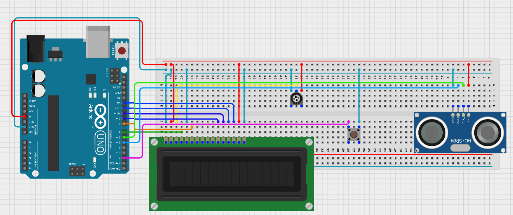

# Portable-Ultrasonic-Distance-Sensor
A portable, on-demand distance measurement tool that tracks ultrasonic wave reflections using an HC-SR04 sensor, averaging multiple rapid samples for precise distance logging onto a 16x2 LCD.

---
## Demo

---
## Circuit

## Components
* 1x Arduino Uno (or compatible microcontroller)
* 1x HC-SR04 Ultrasonic Distance Sensor
* 1x Push-Button
* 1x Liquid Crystal Display (LCD 16x2)
* 1x 10kΩ Potentiometer
* Bread Board & Jumper Wires
## Connections between LCD and Arduino
| Arduino Pin | LCD Pin | Function |
| :--- | :--- | :--- |
| GND | VSS | Ground |
| 5V | VDD | Power |
| Potentiometer Wiper | VO | Contrast Adjustment |
| Pin 7 | rs Pin | Register Select |
| GND | RW | Read/Write Select (Write Mode) |
| Pin 8 | en Pin | Enable Signal |
| Pin 9 | d4 Pin | Data Bit 4 |
| Pin 10 | d5 Pin | Data Bit 5 |
| Pin 11 | d6 Pin | Data Bit 6 |
| Pin 12 | d7 Pin | Data Bit 7 |
| 5V | A | Backlight Anode (+) |
| GND | K | Backlight Cathode (+) |

---
## How It Works
The system idles inside a blocking `while(buttonVal == 1)` loop, prompting the user to press the button. Once a `LOW` (`0`) state is detected from the button press, it kicks off a rapid sampling sequence.
Inside the measurement execution loop:

* The code fires a 10-microsecond high pulse through `trigPin` to emit an ultrasonic sound wave.

* `pulseIn(echoPin, HIGH)` tracks the microsecond flight time (`pingTravelTime`) until the reflected echo bounces back.

* The flight time is converted to centimeters by multiplying it by the speed of sound ($0.0343\text{ cm/}\mu\text{s}$).

* The system repeats this 50 times inside a `for` loop, adding the values to a data `bucket`. It calculates a stable `avgDis`, clears the LCD, and presents the final value for 5 seconds before resetting.

---
## Concepts Covered
* **Time-of-Flight Calculation (ToF):** Measuring the speed-of-sound propagation delays over microsecond scales to derive physical physical distances.

* **Data Smoothing & Noise Reduction:** Accumulating data samples in a tracking variable (`bucket`) to compute an algebraic moving average (`avgDis`), eliminating individual sensor anomalies.

* **On-Demand Execution:** Managing asynchronous loop locks to transition the microchip out of idle states when a mechanical interface interrupt triggers.

* **Microsecond Signal Timing:** Generating precise clock-gated hardware triggers (`delayMicroseconds()`) to meet specific sensor protocol requirements.

---
## Skills
`Signal Flight Evaluation` `Data Averaging Algorithms` `Blocking Interface Workflows` `Physical Calibration`
